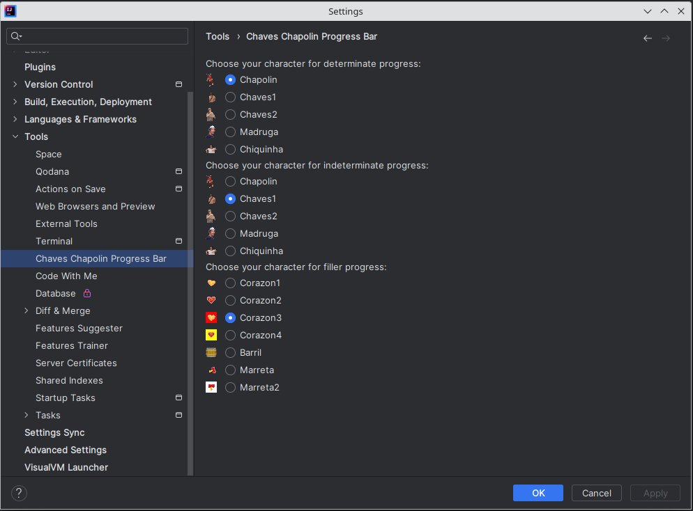
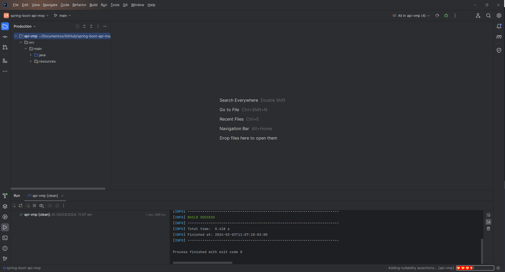
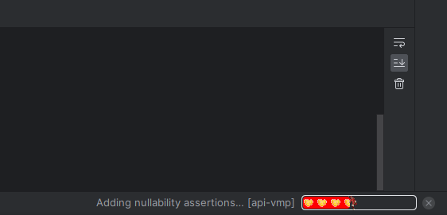

# ChavesChapolinProgressBar

The Chaves & Chapolin progress bar for IntelliJ IDEA and other JetBrains IDEs.
  
This is the [Chaves Chapolin Progress Bar](https://plugins.jetbrains.com/plugin/) for [JetBrains IntelliJ IDEA](https://www.jetbrains.com/idea/) based on the Mario Progress Bar by KikiManjaro. 

## Configuration

You can access plugin's configuration in :

Settings > Tools > Chaves Chapolin Progress Bar

[plugin](media/plugin.mp4)

## Acknowledgements

### Sprites

* All sprites belong to Grupo Chespirito . Find them on  [Giphy](https://giphy.com/grupochespirito)

### Code

* The code for the progress bar was adapted from [MarioProgressBar]( https://github.com/KikiManjaro/MarioProgressBar).
* This plugin is of course heavily dependent on JetBrains' IntelliJ SDK  
